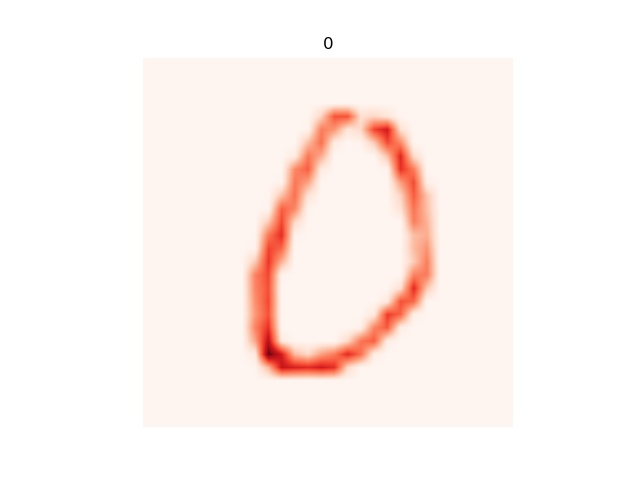
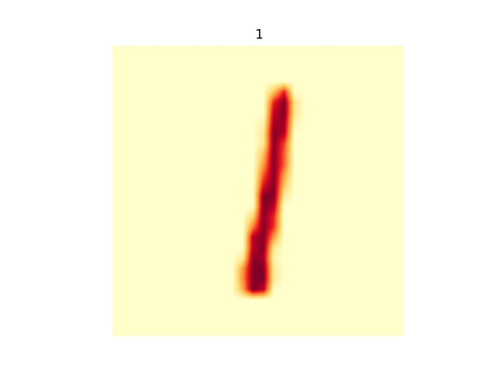
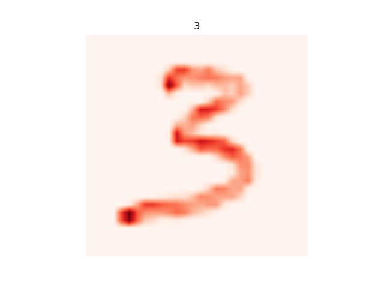
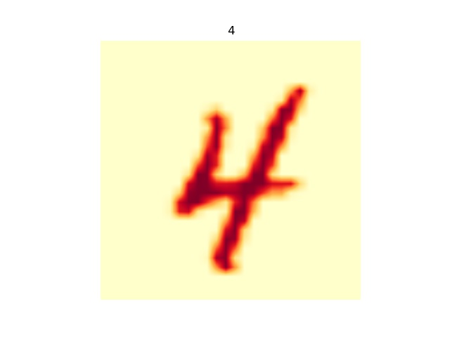
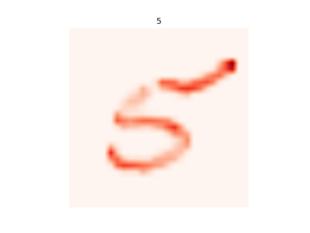
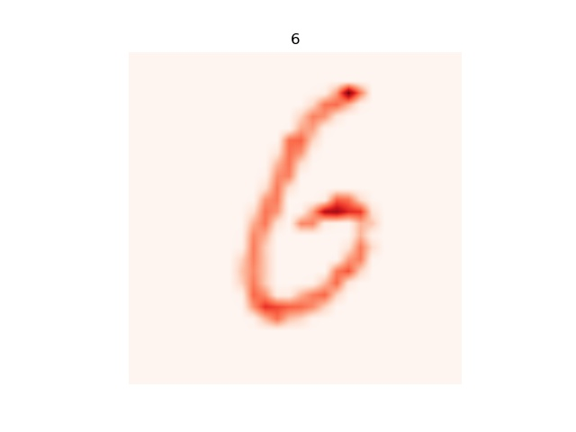
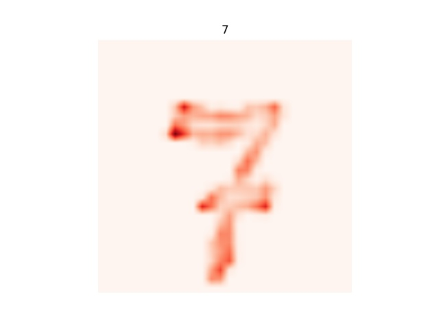
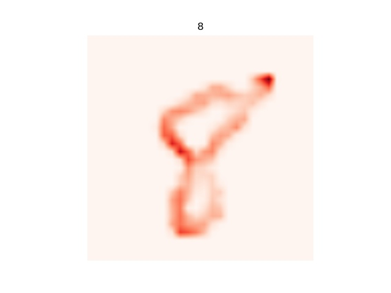
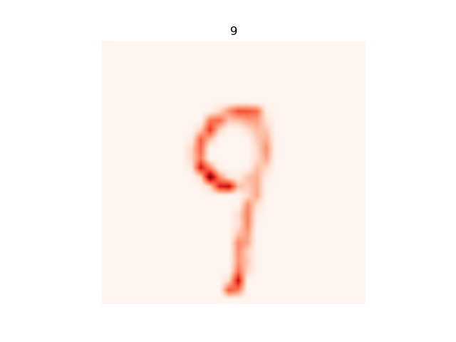

# Deep-Taylor-Decomposition
Implementation of Deep Taylor Decomposition for heatmapping "deep" layers, using Tensorflow.

## Results

### MNIST

  
   
  
  
  

  
   
  
  
  

## Instructions

* Run `train.py` to train model. 
* Weights will be saved in `logs/`. 
* Run `taylor.py` for Deep Taylor Decomposition.

## Reference
* [Explaining NonLinear Classification Decisions with Deep Taylor Decomposition](https://arxiv.org/abs/1512.02479)
* [A Quick Introduction to Deep Taylor Decomposition](http://heatmapping.org/deeptaylor/)
