# Layerwise-Relevance-Propagation
Implementation of Layerwise Relevance Propagation for heatmapping "deep" layers, using Tensorflow and Keras.

## Results

### MNIST

  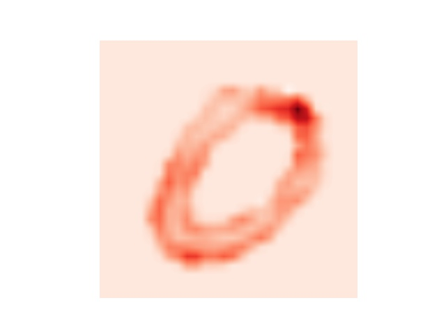
  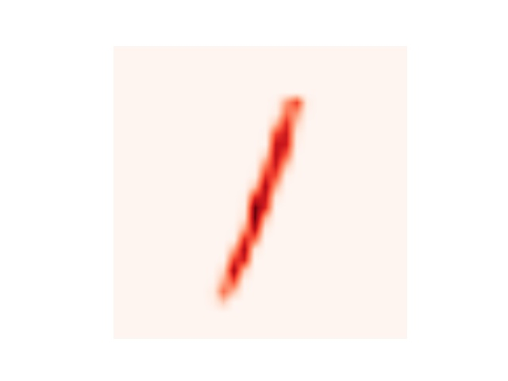 
  
  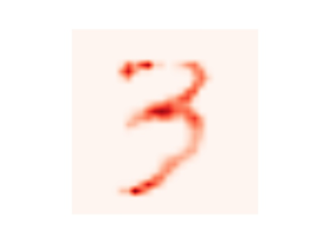
  

  
   
  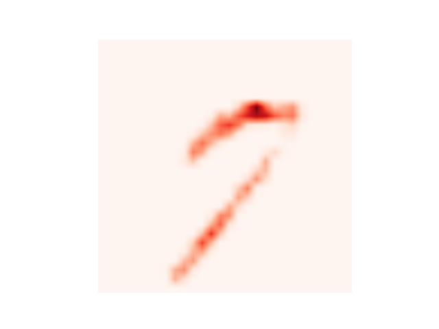
  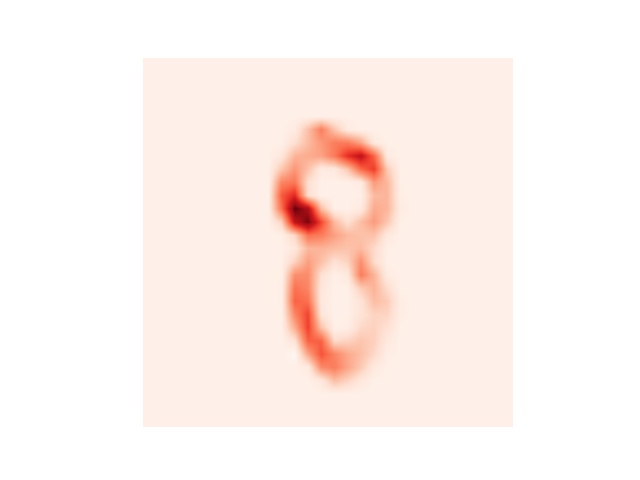
  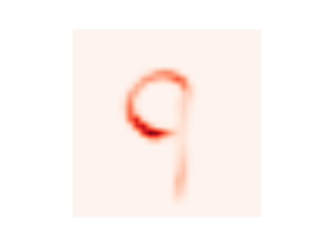

### VGG

  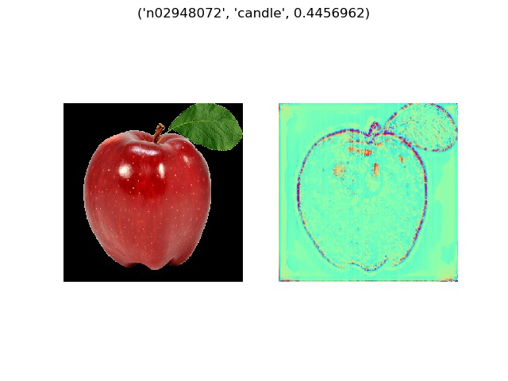
  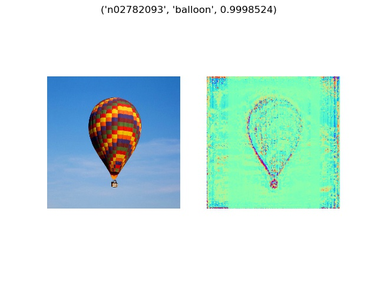

  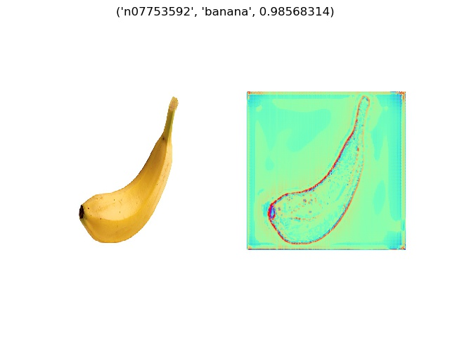
  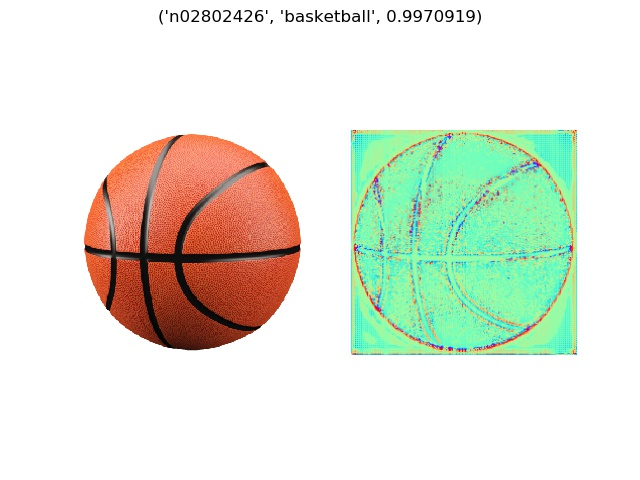

  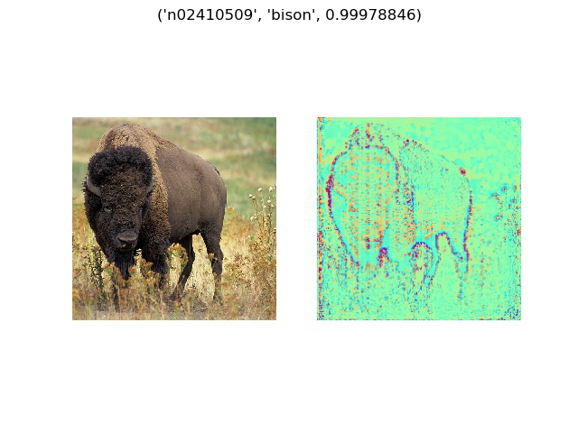
  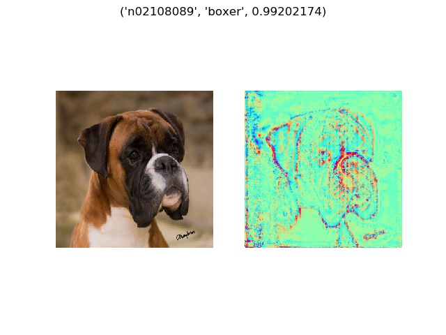

  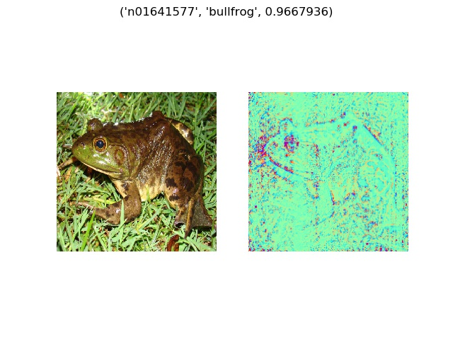
  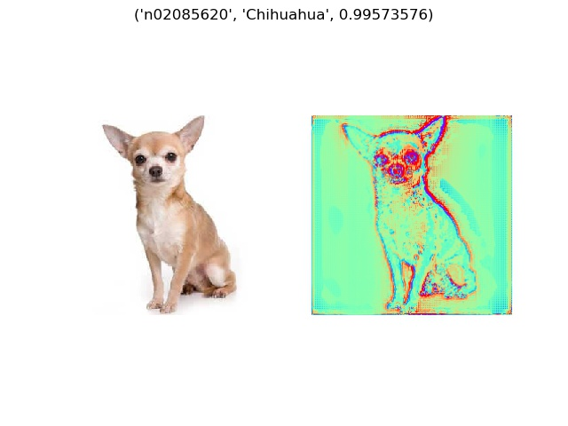

  
  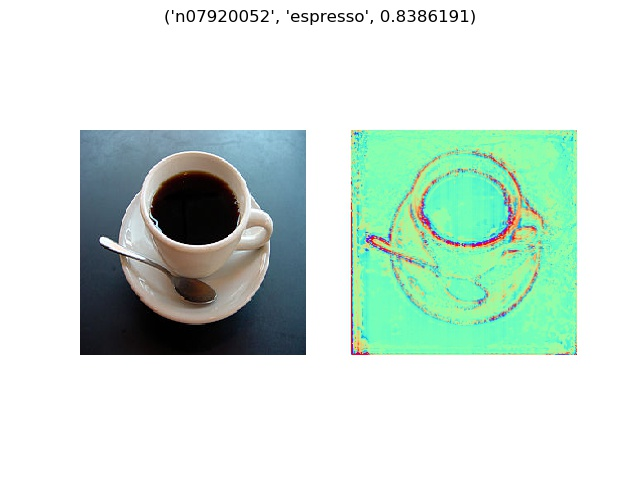

  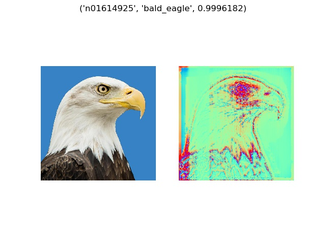
  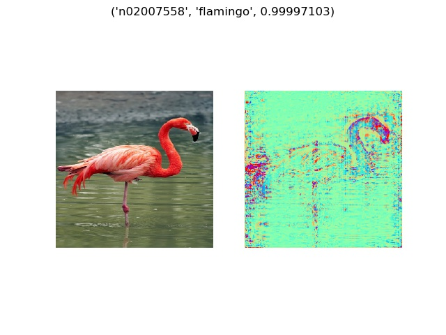

  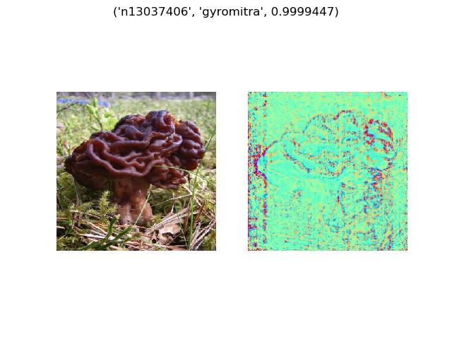
  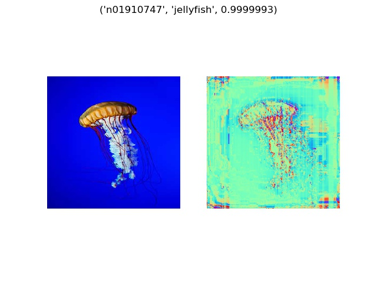

  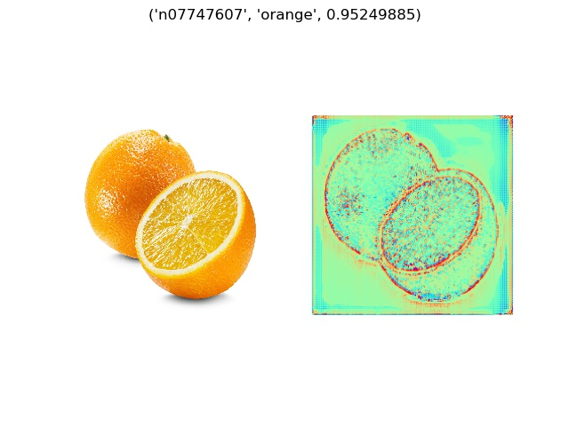
  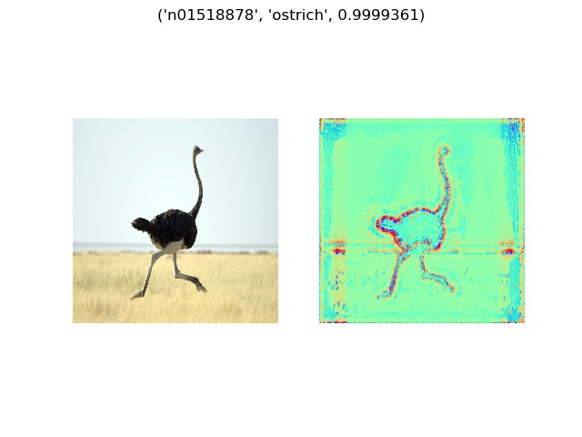

  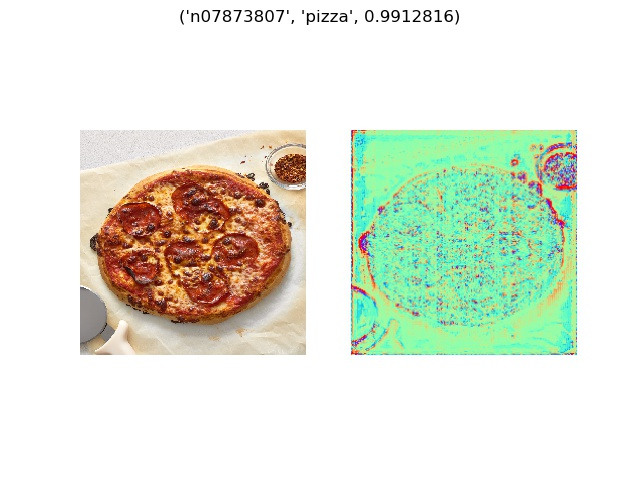
  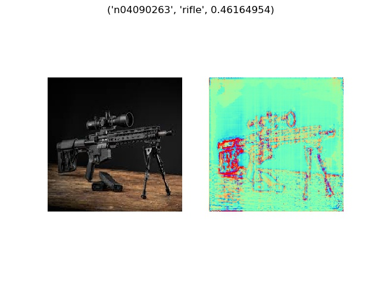

  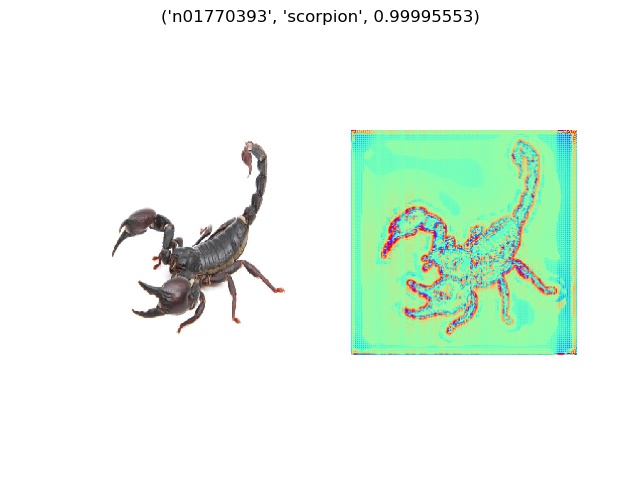
  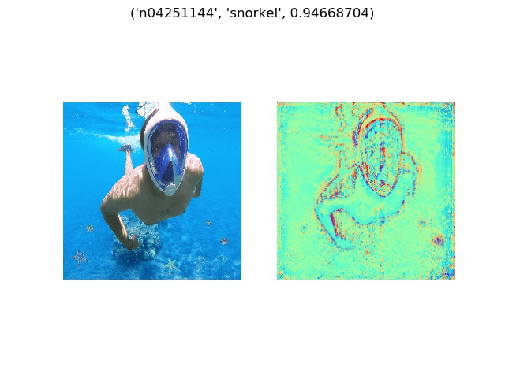

  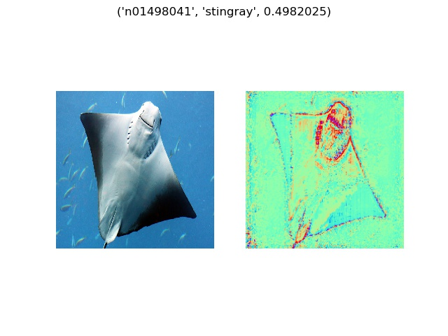
  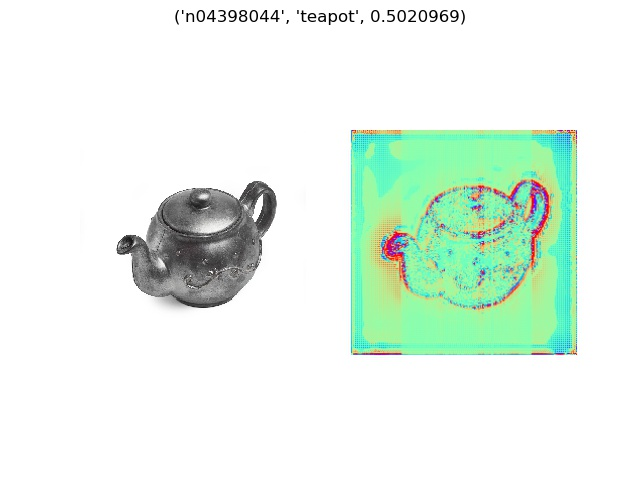

  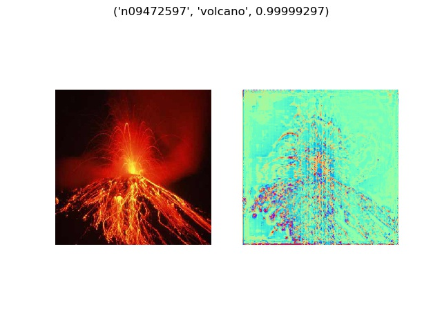
  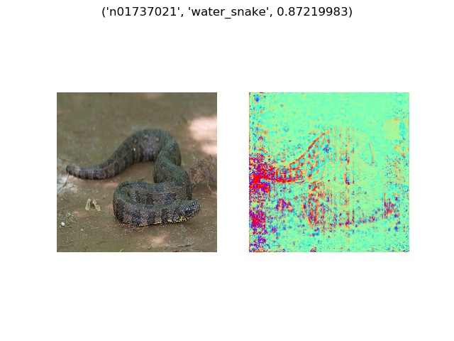

## Instructions

### MNIST
* Run `train.py` to train model. 
* Weights will be saved in `logs/`. 
* Run `lrp.py` for Layerwise Relevance Propagation.

NOTE: If using Tensorflow version < `1.5.0`, you need to change 
`tf.nn.softmax_cross_entropy_with_logits_v2` to `tf.nn.softmax_cross_entropy_with_logits`.

### VGG
* Feed a list of images to run Layerwise Relevance Propagation on all images.
* All results will be saved in `results/`.
* Run `lrp.py <image_1> <image_2> ... <image_n>`.

## Reference
* [On Pixel-Wise Explanations for Non-Linear Classifier Decisions by Layer-Wise Relevance Propagation](http://journals.plos.org/plosone/article?id=10.1371/journal.pone.0130140)
* [Explaining NonLinear Classification Decisions with Deep Taylor Decomposition](https://arxiv.org/abs/1512.02479)
* [Understanding Neural Networks with Layerwise Relevance Propagation and Deep Taylor Series](http://danshiebler.com/2017-04-16-deep-taylor-lrp/)
* [A Quick Introduction to Deep Taylor Decomposition](http://heatmapping.org/deeptaylor/)
* [Tutorial: Implementing Layer-Wise Relevance Propagation](http://www.heatmapping.org/tutorial/)
